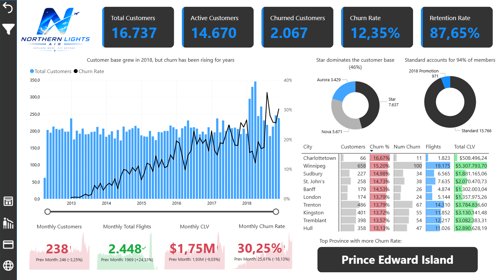
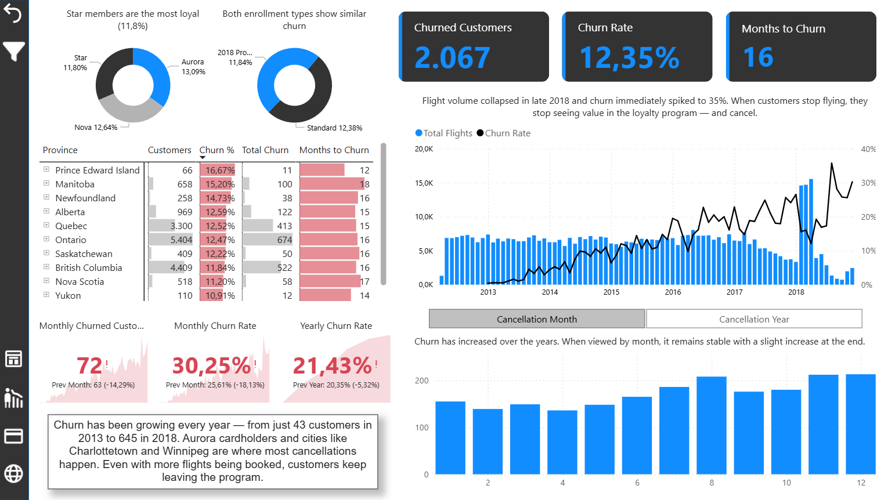
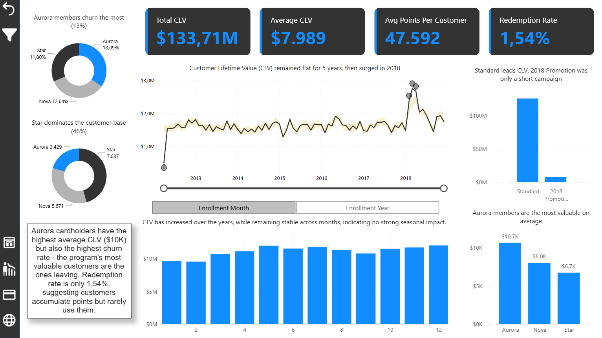
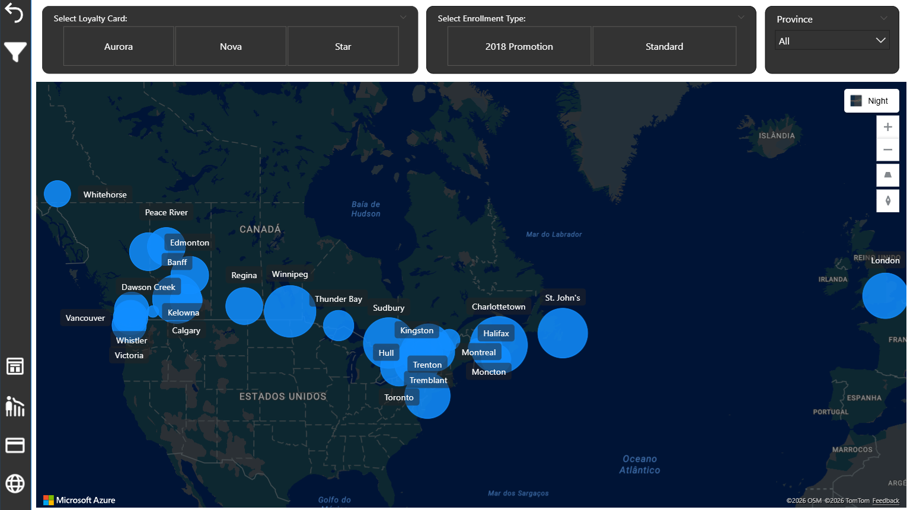

# ✈️📊 Airline Loyalty Analysis — Churn & Customer Value

## 🚀 Resumo Executivo
Este projeto destaca três pontos principais:

- A **base de clientes cresceu ao longo do tempo**, mas o **churn tem aumentado de forma consistente**, indicando desafios de retenção  
- A **atividade dos clientes**, especialmente o número de voos, está fortemente ligada à retenção  
- Clientes de maior valor, como os membros **Aurora**, apresentam maior CLV, mas também maior risco de churn  

👉 Estes resultados mostram que o programa está a crescer, mas também revelam um problema importante de **retenção e engagement dos clientes**.

## 📌 Visão Geral do Projeto
Este projeto analisa o comportamento dos clientes, o desempenho do programa de fidelização e os padrões de churn de uma companhia aérea.

O objetivo foi construir uma solução analítica end-to-end, desde a **criação e preparação dos dados em SQL** até à criação de um **dashboard interativo em Power BI**, focado em insights de negócio.

## 🎯 Objetivos de Negócio
- Analisar a evolução do churn ao longo do tempo  
- Identificar segmentos com maior risco de churn  
- Compreender a relação entre atividade dos clientes e retenção  
- Avaliar o valor dos clientes através do CLV  
- Monitorizar métricas-chave:
  - Total de Clientes  
  - Clientes Ativos  
  - Clientes Churned  
  - Churn Rate  
  - Retention Rate  
  - Total Flights  
  - Customer Lifetime Value (CLV)  

## 🛠️ Ferramentas e Tecnologias
- **SQL Server** → criação da base de dados, limpeza, transformação e modelação  
- **Power BI** → visualização de dados e desenvolvimento do dashboard  
- **DAX** → criação de medidas e cálculos analíticos  

## 🧠 Preparação dos Dados (SQL)
Foi criado um schema dedicado **Analytics** por cima dos dados brutos no schema **Loyalty**, separando os dados operacionais dos dados prontos para análise.

### Principais passos:
- Criação da base de dados `Airline_Loyalty_Analysis`  
- Criação dos schemas:
  - `Loyalty`
  - `Analytics`
- Criação das tabelas:
  - `Calendar`
  - `Customer_Flight_Activity`
  - `Customer_Loyalty_History`
- Importação dos dados através de `BULK INSERT`
- Conversão de tipos de dados para formatos numéricos e temporais corretos  
- Agregação da atividade de voos por cliente, ano e mês  
- Correção de salários negativos usando `ABS()`  
- Criação da coluna `SalaryMissing` para identificar salários em falta  
- Criação da coluna `IsActive` para análise de churn:
  - `1` = cliente ativo
  - `0` = cliente churned
- Criação de views analíticas:
  - `VW_Calendar`
  - `VW_Customer_Flight_Activity`
  - `VW_Customer_Loyalty_History`

👉 Resultado: um dataset estruturado, limpo e otimizado para análise em Power BI.

## 📊 Dashboard

### Overview
- KPIs principais: Total Customers, Active Customers, Churned Customers, Churn Rate, Retention Rate  
- Evolução da base de clientes vs churn ao longo do tempo  
- Distribuição de clientes por loyalty card  
- Distribuição por enrollment type  
- Análise por cidade com clientes, churn, voos e CLV  
- KPIs mensais com comparação face ao mês anterior  

### Churn Analysis
- Churn rate ao longo do tempo  
- Churn por loyalty card  
- Churn por enrollment type  
- Churn por cidade  
- Análise mensal e anual do churn  
- Months to churn  

### Loyalty Analysis
- Total CLV  
- Average CLV  
- Average Points per Customer  
- Redemption Rate  
- Evolução do CLV ao longo do tempo  
- CLV por enrollment type  
- CLV por loyalty card  

### Geography
- Distribuição geográfica dos clientes  
- Filtros por loyalty card, enrollment type e province  
- Mapa interativo com localização dos clientes  
- Tooltip com métricas principais por cidade  

## 📸 Dashboard Preview

### Overview

### Churn Analysis

### Loyalty Analysis

### Geography

## 📖 Data Dictionary

### Customer Flight Activity

| Column | Description |
|---|---|
| Loyalty Number | Número único do cliente no programa de fidelização |
| Year | Ano do período |
| Month | Mês do período |
| Total Flights | Total de voos realizados no período |
| Distance | Distância percorrida no período |
| Points Accumulated | Pontos acumulados no período |
| Points Redeemed | Pontos resgatados no período |
| Dollar Cost Points Redeemed | Valor monetário dos pontos resgatados |

### Customer Loyalty History

| Column | Description |
|---|---|
| Loyalty Number | Número único do cliente no programa de fidelização |
| Country | País de residência |
| Province | Província de residência |
| City | Cidade de residência |
| Postal Code | Código postal |
| Gender | Género |
| Education | Nível de escolaridade |
| Salary | Rendimento anual |
| Salary Missing | Flag que identifica salários em falta |
| Marital Status | Estado civil |
| Loyalty Card | Nível do cartão de fidelização |
| CLV | Customer Lifetime Value |
| Enrollment Type | Tipo de adesão |
| Enrollment Year | Ano de entrada no programa |
| Enrollment Month | Mês de entrada no programa |
| Cancellation Year | Ano de cancelamento |
| Cancellation Month | Mês de cancelamento |
| IsActive | Flag de estado do cliente: 1 = ativo, 0 = churned |

## 💡 Principais Insights

📈 A base de clientes cresceu ao longo do tempo, especialmente em 2018, mas o churn também aumentou de forma consistente  

📉 O churn tem vindo a crescer ano após ano, revelando desafios de retenção  

✈️ A queda no volume de voos no final de 2018 coincide com um aumento imediato no churn  

👥 Clientes Aurora apresentam o maior CLV médio, mas também o maior churn rate, representando risco de perda de clientes valiosos  

🌍 Algumas cidades concentram níveis mais elevados de churn, como Charlottetown e Winnipeg  

🎯 O CLV manteve-se relativamente estável durante vários anos, com um aumento significativo em 2018  

🔁 A redemption rate é baixa, sugerindo que muitos clientes acumulam pontos, mas raramente os utilizam  

## ⚠️ Limitações
- Dataset simulado  
- Não inclui fatores externos como campanhas, preços, concorrência ou sazonalidade real  
- Não existem razões explícitas para cancelamento  
- A análise de churn é baseada nos dados de cancelamento disponíveis  

## 🚀 Próximos Passos
- Criar segmentação de clientes com base em comportamento  
- Desenvolver modelo preditivo de churn  
- Analisar retenção por cidade e loyalty card  
- Explorar estratégias para aumentar a utilização de pontos  
- Avaliar campanhas direcionadas para clientes de maior valor  

## 📂 Estrutura do Projeto

    Dataset/
    SQL_Analysis/
    Power_BI/
    ├── Airline_Loyalty_Analysis.pbix
    └── Images/
    README.md

## 👤 Autor
Projeto desenvolvido por João, focado em análise de dados end-to-end, churn, valor do cliente e tomada de decisão baseada em dados.
